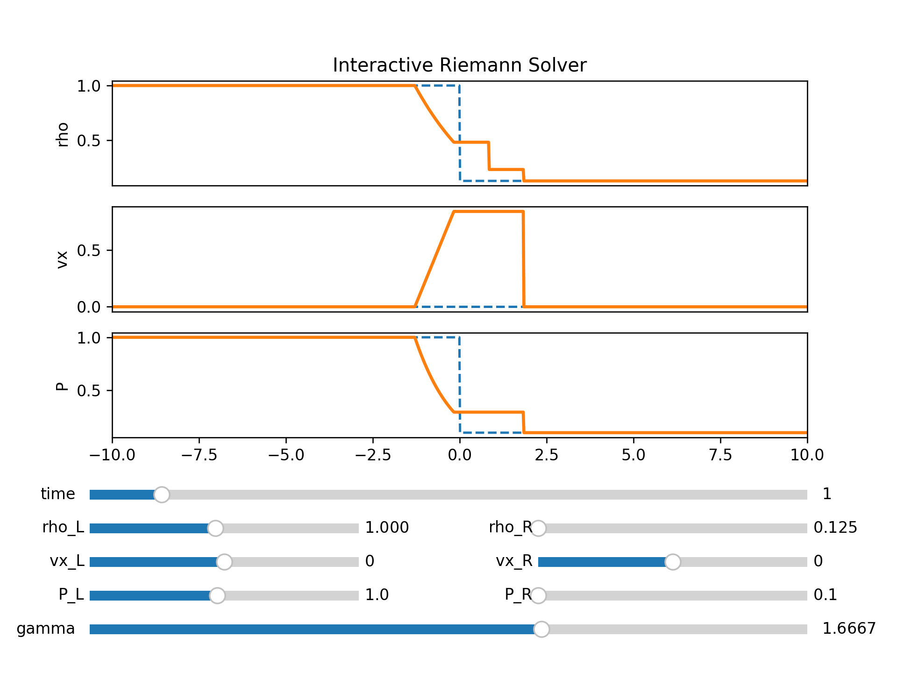

# riemann-solver-python
Riemann solver for the Euler equations

## Create Your Own Riemann Solver (With Python)

### Philip Mocz (2023) [@PMocz](https://twitter.com/PMocz)

### [📝 Read the Algorithm Write-up on Medium]()

Solver the Riemann problem for the Euler equations. Method can be coupled to finite volume solvers


```
python riemann-solver-spectral.py
```


